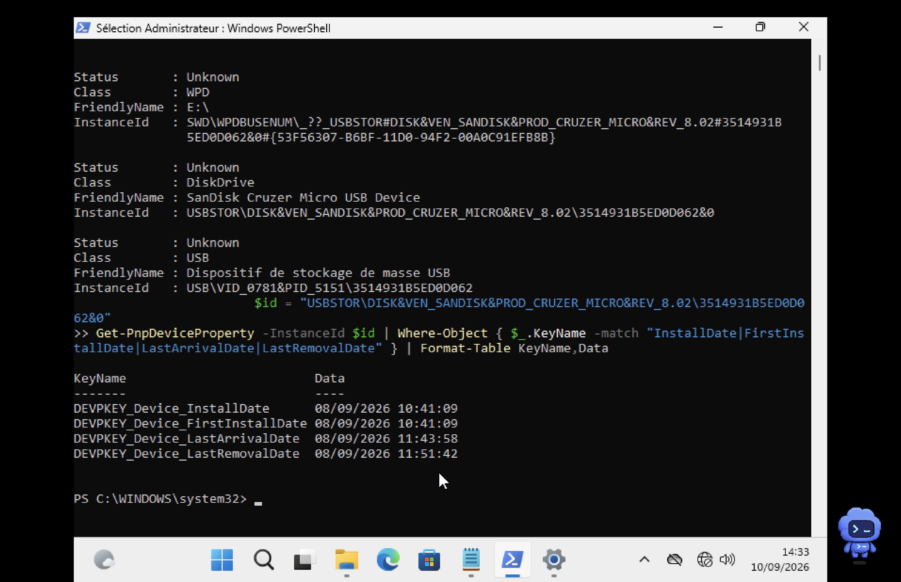

# US 10 : Chronologie de l'utilisation de la clé USB

## Objectif

Déterminer quand la clé USB identifiée dans l'US 9 a été utilisée sur la machine Windows.

## Commandes utilisées

```powershell
Get-PnpDevice -PresentOnly:$false |
    Where-Object { $_.InstanceId -like "*3514931B5ED0D062*" } |
    Format-List Status,Class,FriendlyName,InstanceId
```

```powershell
$id = "USBSTOR\DISK&VEN_SANDISK&PROD_CRUZER_MICRO&REV_8.02\3514931B5ED0D062&0"

Get-PnpDeviceProperty -InstanceId $id |
    Where-Object { $_.KeyName -match "InstallDate|FirstInstallDate|LastArrivalDate|LastRemovalDate" } |
    Format-Table KeyName,Data
```

## Identification retrouvée dans Windows

Les informations PnP correspondent à la clé de l'US 9 :

| Information | Valeur |
| --- | --- |
| Fabricant | `SanDisk` |
| Modèle | `Cruzer Micro` |
| Numéro de série | `3514931B5ED0D062` |
| VID / PID | `0781` / `5151` |
| Lettre de lecteur observée | `E:\` |

## Chronologie

| Événement | Horodatage |
| --- | --- |
| Installation du périphérique | 08/09/2026 10:41:09 |
| Première installation | 08/09/2026 10:41:09 |
| Dernière connexion | 08/09/2026 11:43:58 |
| Dernier retrait | 08/09/2026 11:51:42 |

La dernière connexion documentée dure au plus 7 minutes et 44 secondes avant le dernier retrait observé.

## Preuve



## Conclusion

La clé SanDisk Cruzer Micro, série `3514931B5ED0D062`, est bien retrouvée dans les informations PnP de Windows. Les horodatages montrent une première installation le 08/09/2026 à 10:41:09, une dernière connexion à 11:43:58 et un dernier retrait à 11:51:42.

Ces éléments établissent une chronologie d'utilisation du périphérique. Ils ne prouvent pas, à eux seuls, quels fichiers ont été copiés pendant la connexion.

## Vérification des critères d'acceptation

- Horodatages exploitables : couverts avec la première installation, la dernière connexion et le dernier retrait.
- Chronologie des événements : couverte.
