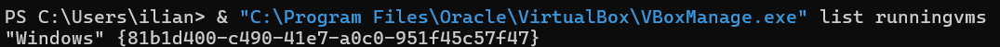
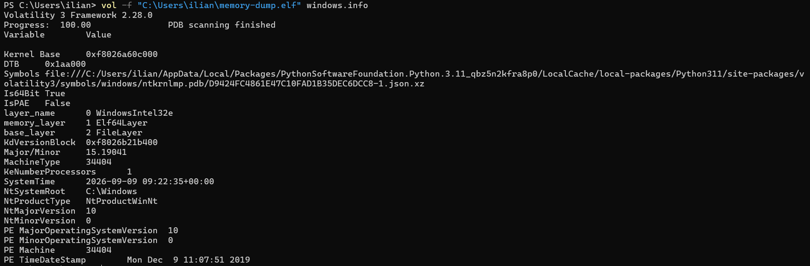
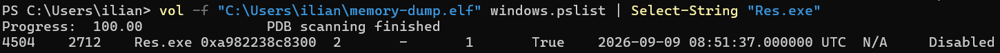
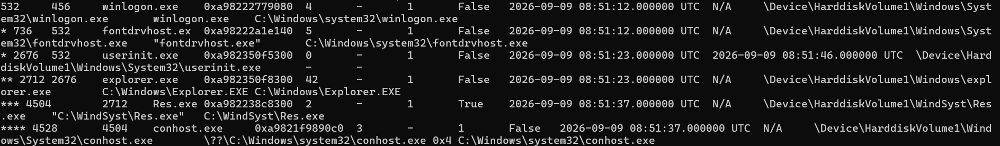
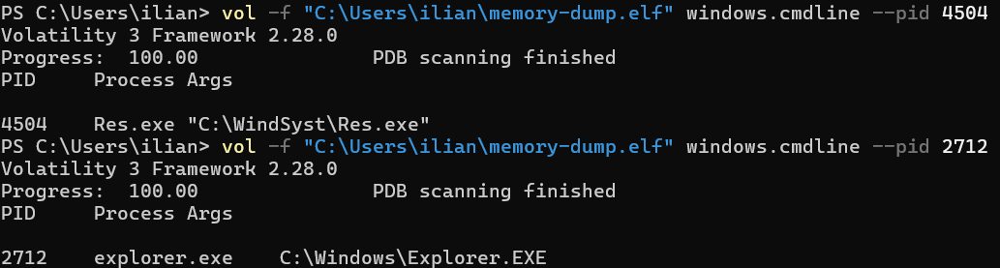
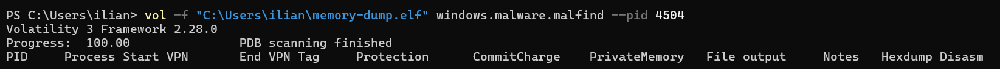
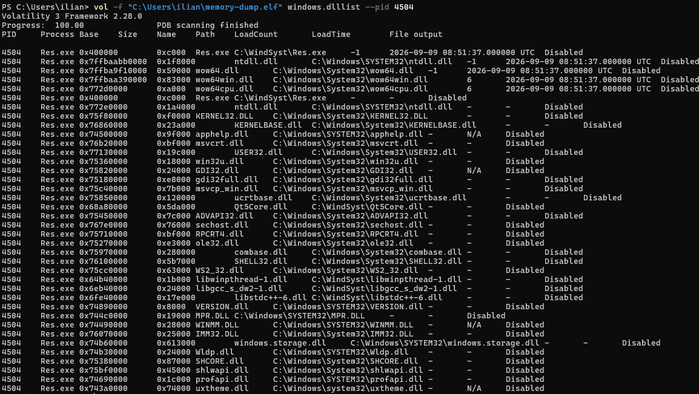

# Analyse mémoire Windows 10 avec VirtualBox et Volatility 3

## Contexte

L’objectif est de récupérer la mémoire d’une machine virtuelle Windows 10, puis de l’analyser avec Volatility 3 afin d’observer le comportement de Res.exe.

Le dump utilisé est :

    C:\Users\ilian\memory-dump.elf

---

# 1. Identifier la machine virtuelle

Commande :

    & "C:\Program Files\Oracle\VirtualBox\VBoxManage.exe" list runningvms

Résultat :

    "Windows" {81b1d400-c490-41e7-a0c0-951f45c57f47}

La machine virtuelle utilisée pour l’analyse se nomme donc Windows.

## Image

---

# 2. Créer le dump mémoire

Commande :

    & "C:\Program Files\Oracle\VirtualBox\VBoxManage.exe" debugvm "Windows" dumpvmcore --filename "C:\Users\ilian\memory-dump.elf"

Cette commande permet de récupérer la mémoire de la VM dans le fichier :

    C:\Users\ilian\memory-dump.elf

VirtualBox génère ici un dump au format ELF, même si le système analysé est Windows.

---

# 3. Identifier le système

Commande :

    vol -f "C:\Users\ilian\memory-dump.elf" windows.info

Cette commande permet de vérifier que Volatility reconnaît correctement le dump et de récupérer les principales informations du système Windows.

## Image

---

# 4. Identifier le processus Res.exe

Commande :

    vol -f "C:\Users\ilian\memory-dump.elf" windows.pslist | Select-String "Res.exe"

Résultat :

    PID        4504
    PPID       2712
    Processus  Res.exe
    Wow64      True

Une seule instance active de Res.exe est présente dans le dump.

La valeur Wow64=True indique qu’il s’agit d’un programme 32 bits exécuté sur un Windows 64 bits.

## Image

---

# 5. Observer l’arbre des processus

Commande :

    vol -f "C:\Users\ilian\memory-dump.elf" windows.pstree

Chaîne observée :

    userinit.exe PID 2676
        explorer.exe PID 2712
            Res.exe PID 4504
                conhost.exe PID 4528

Res.exe a donc été lancé depuis explorer.exe et crée ensuite un processus conhost.exe.

Le chemin du programme est :

    C:\WindSyst\Res.exe

## Image

---

# 6. Vérifier la ligne de commande

Commande :

    vol -f "C:\Users\ilian\memory-dump.elf" windows.cmdline --pid 4504

Résultat :

    "C:\WindSyst\Res.exe"

La ligne de commande confirme que le programme exécuté correspond bien au fichier situé dans C:\WindSyst.

## Image

---

# 7. Vérifier l’activité réseau

Commande :

    vol -f "C:\Users\ilian\memory-dump.elf" windows.netscan | Select-String "4504"

Aucun résultat n’est retourné.

Aucune connexion réseau associée à Res.exe n’est donc visible dans ce dump mémoire.

## Image

---

# 8. Vérifier les zones mémoire avec malfind

Commande :

    vol -f "C:\Users\ilian\memory-dump.elf" windows.malware.malfind --pid 4504

Volatility ne retourne aucune région mémoire pour Res.exe.

Aucune zone correspondant aux critères de détection de malfind n’a donc été identifiée dans le processus PID 4504.

## Image

---

# 9. Examiner les DLL chargées

Commande :

    vol -f "C:\Users\ilian\memory-dump.elf" windows.dlllist --pid 4504

Plusieurs DLL sont chargées directement depuis le dossier de Res.exe :

    C:\WindSyst\Qt5Core.dll
    C:\WindSyst\libwinpthread-1.dll
    C:\WindSyst\libgcc_s_dw2-1.dll
    C:\WindSyst\libstdc++-6.dll

Ces bibliothèques indiquent que Res.exe semble être une application C++ utilisant Qt 5 et des bibliothèques GCC / MinGW.

Le processus charge également des DLL Windows classiques comme :

    KERNEL32.DLL
    USER32.dll
    ADVAPI32.dll
    SHELL32.dll
    WS2_32.dll

La présence de WS2_32.dll signifie que le programme charge la bibliothèque réseau de Windows, mais aucune connexion réseau n’a été observée avec netscan.

## Image

---

# Conclusion

L’analyse du dump mémoire permet d’identifier une seule instance de Res.exe avec le PID 4504.

Le programme est lancé depuis explorer.exe et se trouve dans :

    C:\WindSyst\Res.exe

Il s’agit d’un programme 32 bits fonctionnant sur un Windows 64 bits.

Aucune activité réseau n’a été retrouvée et malfind n’a détecté aucune région mémoire particulière.

L’analyse des DLL montre que Res.exe utilise notamment Qt 5 ainsi que plusieurs bibliothèques C++ GCC / MinGW présentes dans son dossier.

La suite de l’analyse peut maintenant se concentrer sur les fichiers, les handles et les données manipulées localement par le processus.
