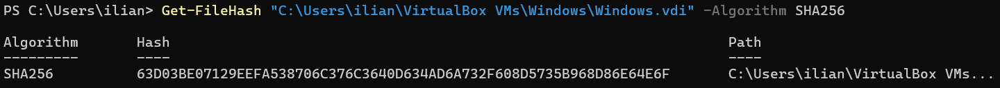
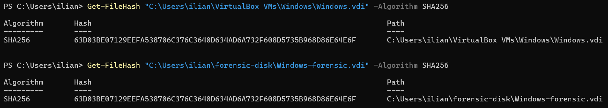
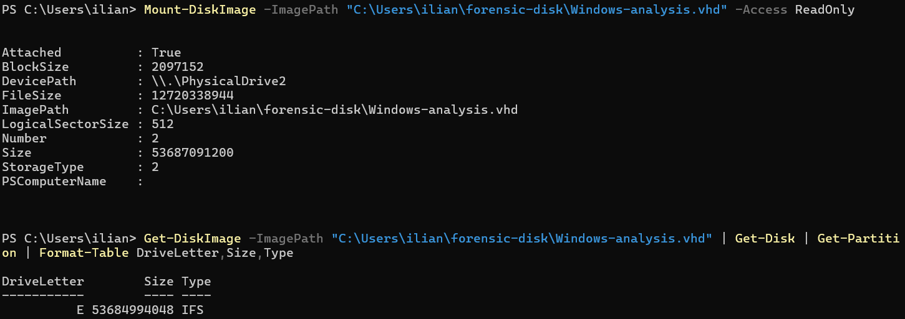
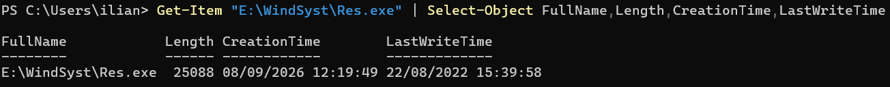

# US7 - Acquisition bit-à-bit et analyse du disque de la VM Windows

## Objectif

L’objectif de cette story est de réaliser une acquisition forensique du disque de la machine virtuelle afin d’identifier les fichiers suspects présents sur le système.

Critères d’acceptation :

- image disque bit-à-bit réalisée ;
- outils utilisés indiqués ;
- fichiers suspects identifiés.

---

# Outils utilisés

- VirtualBox ;
- VBoxManage ;
- PowerShell.

Aucun logiciel supplémentaire n’a été installé pour réaliser cette acquisition.

---

# 1. Identifier le disque de la machine virtuelle

Pour retrouver le disque associé à la VM Windows, la commande suivante est utilisée :

    & "C:\Program Files\Oracle\VirtualBox\VBoxManage.exe" showvminfo "Windows" --machinereadable | Select-String "\.vdi"

Résultat :

    "SATA-0-0"="C:\\Users\\ilian\\VirtualBox VMs\\Windows\\Windows.vdi"

Le disque virtuel utilisé par la machine est donc :

    C:\Users\ilian\VirtualBox VMs\Windows\Windows.vdi

Une seconde commande permet d’obtenir davantage d’informations sur ce disque :

    & "C:\Program Files\Oracle\VirtualBox\VBoxManage.exe" list hdds

Résultat observé :

    UUID:           4ea9991b-29f2-49bb-b93b-5e429dfa0aae
    Parent UUID:    base
    State:          created
    Type:           normal (base)
    Location:       C:\Users\ilian\VirtualBox VMs\Windows\Windows.vdi
    Storage format: VDI
    Capacity:       51200 MBytes
    Encryption:     disabled

Le disque virtuel possède donc une capacité logique d’environ 50 Go.

## Image

---

# 2. Calculer le hash du disque original

Avant de réaliser la copie, une empreinte SHA-256 du fichier VDI original est calculée :

    Get-FileHash "C:\Users\ilian\VirtualBox VMs\Windows\Windows.vdi" -Algorithm SHA256

Résultat obtenu :

    63D03BE07129EEFA538706C376C3640D634AD6A732F608D5735B968D86E64E6F

Cette empreinte permet d’identifier précisément l’état du disque avant l’acquisition et servira ensuite à vérifier l’intégrité de la copie.

## Image

---

# 3. Réaliser la copie bit-à-bit

Un dossier dédié à l’acquisition est créé :

    New-Item -ItemType Directory -Path "C:\Users\ilian\forensic-disk" -Force

Une copie exacte du fichier VDI est ensuite réalisée :

    Copy-Item "C:\Users\ilian\VirtualBox VMs\Windows\Windows.vdi" "C:\Users\ilian\forensic-disk\Windows-forensic.vdi"

La copie obtenue est :

    C:\Users\ilian\forensic-disk\Windows-forensic.vdi

Dans le contexte de cette machine virtuelle, le fichier Windows.vdi représente déjà l’image du disque virtuel. La copie réalisée correspond donc à une copie bit-à-bit de ce fichier image.

---

# 4. Vérifier l’intégrité de la copie

Le SHA-256 de la copie forensic est calculé :

    Get-FileHash "C:\Users\ilian\forensic-disk\Windows-forensic.vdi" -Algorithm SHA256

Résultat obtenu :

    63D03BE07129EEFA538706C376C3640D634AD6A732F608D5735B968D86E64E6F

Le hash est identique à celui du fichier VDI original.

## Résultat

    SHA256 original : 63D03BE07129EEFA538706C376C3640D634AD6A732F608D5735B968D86E64E6F
    SHA256 forensic : 63D03BE07129EEFA538706C376C3640D634AD6A732F608D5735B968D86E64E6F
    Identiques      : Oui

Cette correspondance confirme que la copie forensic est identique au fichier source.

## Image

---

# 5. Créer une copie de travail pour l’analyse

La copie forensic est conservée intacte.

Une copie de travail au format VHD est créée à partir du disque original avec VBoxManage afin de pouvoir l’analyser depuis Windows :

    & "C:\Program Files\Oracle\VirtualBox\VBoxManage.exe" clonemedium disk "C:\Users\ilian\VirtualBox VMs\Windows\Windows.vdi" "C:\Users\ilian\forensic-disk\Windows-analysis.vhd" --format VHD

Le fichier utilisé pour l’analyse est :

    C:\Users\ilian\forensic-disk\Windows-analysis.vhd

---

# 6. Monter le disque de travail en lecture seule

Le fichier VHD est monté en lecture seule depuis PowerShell :

    Mount-DiskImage -ImagePath "C:\Users\ilian\forensic-disk\Windows-analysis.vhd" -Access ReadOnly

Les partitions présentes sur le disque sont ensuite affichées :

    Get-DiskImage -ImagePath "C:\Users\ilian\forensic-disk\Windows-analysis.vhd" | Get-Disk | Get-Partition | Format-Table DriveLetter,Size,Type

Cette commande permet d’identifier la lettre attribuée à la partition Windows de la VM. Dans notre cas, la partition analysée est accessible avec la lettre E:.

## Image

---

# 7. Identifier les fichiers suspects

L’analyse mémoire réalisée dans la Story 6 avait permis d’identifier le programme suivant :

    C:\WindSyst\Res.exe

Le fichier est donc recherché directement sur l’image disque montée :

    Get-Item "E:\WindSyst\Res.exe" | Select-Object FullName,Length,CreationTime,LastWriteTime

Le résultat confirme que Res.exe est bien présent sur le disque dans le dossier WindSyst.

Sa présence sur le disque permet de faire le lien avec le processus Res.exe identifié précédemment dans la mémoire vive.

## Image

---

# Conclusion

Une copie bit-à-bit du fichier image VDI de la machine virtuelle a été réalisée puis vérifiée grâce à la comparaison des empreintes SHA-256.

Les outils utilisés pour cette acquisition sont VirtualBox, VBoxManage et PowerShell.

Une copie de travail au format VHD a ensuite été montée en lecture seule afin d’analyser le contenu du disque sans démarrer la machine virtuelle.

L’analyse a permis de confirmer la présence du fichier suspect :

    C:\WindSyst\Res.exe

Ce fichier correspond au processus Res.exe déjà identifié lors de l’analyse mémoire de la Story 6.

Les critères d’acceptation de la Story 7 sont donc couverts : acquisition bit-à-bit, outils documentés et fichier suspect identifié.