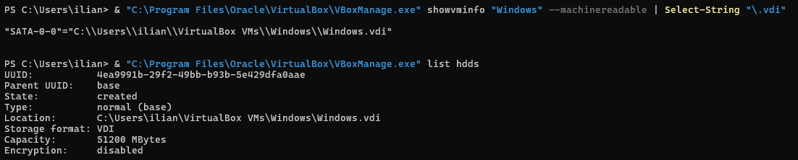
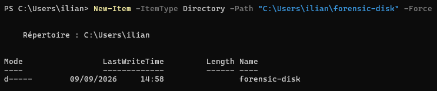
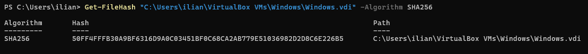
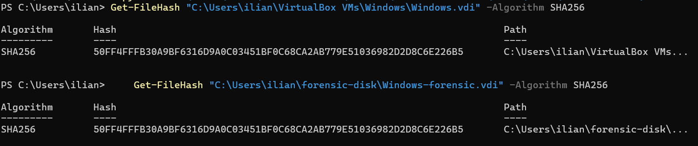

# US7 - Acquisition bit-à-bit et analyse du disque de la VM Windows

## Contexte de la story

La User Story 7 demande de réaliser une acquisition forensique du disque afin de pouvoir analyser les fichiers présents sur le système et identifier les éléments suspects.

Les critères d’acceptation sont :

- une image disque bit-à-bit est réalisée ;
- les outils utilisés sont indiqués ;
- les fichiers suspects sont identifiés.

Dans notre cas, le disque de la machine virtuelle Windows est stocké dans un fichier VDI utilisé par VirtualBox.

Le disque source est :

    C:\Users\ilian\VirtualBox VMs\Windows\Windows.vdi

---

# Outils utilisés

Les outils utilisés pour cette story sont :

- VirtualBox : hébergement de la machine virtuelle Windows 10 ;
- VBoxManage : identification du disque virtuel associé à la VM ;
- PowerShell : calcul des hashes et vérification des disques ;
- Arsenal Image Mounter : montage du VDI en lecture seule ;
- FTK Imager : création de l’image disque bit-à-bit ;
- Autopsy : analyse forensique de l’image disque et recherche des fichiers suspects.

---

# 1. Identifier le disque de la machine virtuelle

Pour retrouver le disque associé à la VM Windows, la commande suivante a été utilisée :

    & "C:\Program Files\Oracle\VirtualBox\VBoxManage.exe" showvminfo "Windows" --machinereadable | Select-String "\.vdi"

Résultat :

    "SATA-0-0"="C:\\Users\\ilian\\VirtualBox VMs\\Windows\\Windows.vdi"

Le disque virtuel utilisé par la machine est donc :

    C:\Users\ilian\VirtualBox VMs\Windows\Windows.vdi

Une seconde commande permet d’obtenir davantage d’informations :

    & "C:\Program Files\Oracle\VirtualBox\VBoxManage.exe" list hdds

Résultat observé :

    UUID:           4ea9991b-29f2-49bb-b93b-5e429dfa0aae
    Parent UUID:    base
    State:          created
    Type:           normal (base)
    Location:       C:\Users\ilian\VirtualBox VMs\Windows\Windows.vdi
    Storage format: VDI
    Capacity:       51200 MBytes
    Encryption:     disabled

Le disque virtuel a donc une capacité de 50 Go environ.

## Image

---

# 2. Créer un dossier pour l’acquisition

Pour séparer les fichiers forensic des fichiers VirtualBox d’origine :

    New-Item -ItemType Directory -Path "C:\Users\ilian\forensic-disk" -Force

Le dossier utilisé sera :

    C:\Users\ilian\forensic-disk

## Image

---

# 3. Calculer le hash du disque original

Avant toute copie, il est important de calculer une empreinte du fichier original.

Commande :

    Get-FileHash "C:\Users\ilian\VirtualBox VMs\Windows\Windows.vdi" -Algorithm SHA256

Le SHA-256 obtenu doit être conservé.

Il permettra ensuite de vérifier que la copie du disque est strictement identique au fichier VDI d’origine.

## Résultat à noter

    SHA256 original : 50FF4FFFB30A9BF6316D9A0C03451BF0C68CA2AB779E51036982D2D8C6E226B5

## Image

---

# 4. Réaliser la copie bit-à-bit du VDI

Le fichier VDI représente déjà l’image du disque virtuel de la machine.

Une copie exacte du fichier est réalisée avec PowerShell :

    Copy-Item "C:\Users\ilian\VirtualBox VMs\Windows\Windows.vdi" "C:\Users\ilian\forensic-disk\Windows-forensic.vdi"

La copie obtenue est :

    C:\Users\ilian\forensic-disk\Windows-forensic.vdi

Cette opération copie le fichier VDI octet par octet sans modifier son contenu.

Dans le contexte de cette machine virtuelle, Windows-forensic.vdi constitue donc la copie bit-à-bit de l’image du disque virtuel.

---

# 5. Vérifier l’intégrité de la copie

Calculer le SHA-256 de la copie :

    Get-FileHash "C:\Users\ilian\forensic-disk\Windows-forensic.vdi" -Algorithm SHA256

Le résultat doit être exactement identique au hash du VDI source :

    50FF4FFFB30A9BF6316D9A0C03451BF0C68CA2AB779E51036982D2D8C6E226B5

Les deux valeurs peuvent être affichées directement avec :

    Get-FileHash "C:\Users\ilian\VirtualBox VMs\Windows\Windows.vdi" -Algorithm SHA256
    Get-FileHash "C:\Users\ilian\forensic-disk\Windows-forensic.vdi" -Algorithm SHA256

## Résultat à compléter

    SHA256 source : 50FF4FFFB30A9BF6316D9A0C03451BF0C68CA2AB779E51036982D2D8C6E226B5
    SHA256 copie  : 50FF4FFFB30A9BF6316D9A0C03451BF0C68CA2AB779E51036982D2D8C6E226B5
    Identiques    : Oui

Si les deux SHA-256 sont identiques, la copie est identique au fichier source.

## Image

