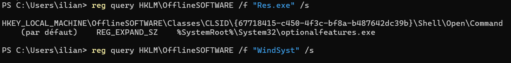

# US8 - Corrélation mémoire / disque et persistance

## Objectif

L’objectif de cette story est de corréler les éléments retrouvés dans la mémoire vive avec ceux présents sur le disque afin de reconstruire un scénario cohérent et de rechercher une éventuelle persistance.

Critères d’acceptation :

- correspondance entre les processus mémoire et les fichiers disque ;
- détection d’une éventuelle persistance.

---

# 1. Corrélation mémoire / disque

Lors de la Story 6, l’analyse mémoire avait identifié :

    Res.exe
    PID : 4504
    Chemin : C:\WindSyst\Res.exe

Plusieurs DLL chargées par le programme avaient également été retrouvées :

    Qt5Core.dll
    libwinpthread-1.dll
    libgcc_s_dw2-1.dll
    libstdc++-6.dll

Lors de la Story 7, Res.exe et les fichiers associés sont également retrouvés sur le disque dans :

    C:\WindSyst\

Les résultats sont donc cohérents : le processus Res.exe observé dans la mémoire correspond bien au fichier présent sur le disque.

---

# 2. Indice de persistance observé

Lors du démarrage de la machine virtuelle, une fenêtre d’invite de commandes apparaît automatiquement et Res.exe se lance sans intervention manuelle.

Ce comportement constitue un indice fort de persistance : le programme semble être configuré pour se relancer automatiquement au démarrage de Windows.

---

# 3. Recherche du mécanisme de persistance

Les recherches sont effectuées sur le disque de travail monté en E:.

## Clés Run et RunOnce

La ruche SOFTWARE est chargée :

    reg load HKLM\OfflineSOFTWARE "E:\Windows\System32\config\SOFTWARE"

Les clés de démarrage automatique sont vérifiées :

    reg query "HKLM\OfflineSOFTWARE\Microsoft\Windows\CurrentVersion\Run"

    reg query "HKLM\OfflineSOFTWARE\Microsoft\Windows\CurrentVersion\RunOnce"

    reg query "HKLM\OfflineSOFTWARE\WOW6432Node\Microsoft\Windows\CurrentVersion\Run"

    reg query "HKLM\OfflineSOFTWARE\WOW6432Node\Microsoft\Windows\CurrentVersion\RunOnce"

La clé Run contient uniquement :

    SecurityHealth    REG_EXPAND_SZ    %windir%\system32\SecurityHealthSystray.exe

Cette entrée correspond à Windows Security et n’est pas liée à Res.exe.

Les autres clés RunOnce et WOW6432Node ne retournent aucun résultat.

Une recherche directe est également effectuée :

    reg query HKLM\OfflineSOFTWARE /f "WindSyst" /s

    reg query HKLM\OfflineSOFTWARE /f "Res.exe" /s

La recherche de WindSyst ne retourne aucun résultat.

La recherche de Res.exe retourne :

    %SystemRoot%\System32\optionalfeatures.exe

Ce résultat n’est pas lié au programme analysé. La chaîne Res.exe est simplement retrouvée à l’intérieur du nom optionalfeatures.exe : il s’agit donc d’un faux positif.

La ruche est ensuite déchargée :

    reg unload HKLM\OfflineSOFTWARE

---

## Dossiers de démarrage

Le dossier Startup de l’utilisateur vboxuser est vérifié :

    Get-ChildItem "E:\Users\vboxuser\AppData\Roaming\Microsoft\Windows\Start Menu\Programs\Startup" -Force

Résultat :

    desktop.ini

Le dossier Startup commun est également vérifié :

    Get-ChildItem "E:\ProgramData\Microsoft\Windows\Start Menu\Programs\StartUp" -Force

Résultat :

    desktop.ini

Aucun fichier permettant de lancer Res.exe n’est présent dans ces dossiers.

---

## Tâches planifiées

Les tâches planifiées sont recherchées avec :

    Get-ChildItem "E:\Windows\System32\Tasks" -Recurse -File -ErrorAction SilentlyContinue | Select-String -Pattern "WindSyst","Res.exe"

Aucun résultat n’est retourné.

Aucune tâche planifiée contenant une référence directe à Res.exe ou WindSyst n’a donc été identifiée avec cette recherche.

---

# 4. Résultat de la recherche de persistance

    Lancement automatique observé : Oui
    Persistance probable : Oui
    Run / RunOnce : aucune référence à Res.exe ou WindSyst
    Dossiers Startup : aucune référence
    Tâches planifiées : aucune référence
    Mécanisme exact identifié : Non

Les recherches réalisées ne permettent donc pas d’identifier précisément le mécanisme responsable du lancement automatique.

Cela ne signifie pas qu’il n’existe aucune persistance : le lancement automatique de Res.exe au démarrage reste un indice fort. Le mécanisme peut se trouver dans un autre emplacement, par exemple dans une configuration propre à l’utilisateur ou dans un autre mécanisme de démarrage Windows non vérifié ici.

## Image

---

# 5. Scénario reconstitué

Le scénario obtenu est :

1. Res.exe est présent sur le disque dans :

       C:\WindSyst\Res.exe

2. Le même programme est retrouvé actif en mémoire avec le PID 4504.

3. Les DLL observées en mémoire sont également présentes dans le même dossier sur le disque.

4. Lors du démarrage de la VM, Res.exe se lance automatiquement avec l’apparition d’une invite de commandes.

5. Les clés Run / RunOnce, les dossiers Startup et les tâches planifiées ont été vérifiés, mais aucune référence directe à Res.exe ou WindSyst n’a été retrouvée.

6. La persistance est donc probable d’après le comportement observé, mais son mécanisme exact n’a pas été identifié avec les vérifications réalisées.

---

# Conclusion

La corrélation entre la mémoire et le disque est confirmée : les éléments observés lors de la Story 6 sont bien retrouvés sur le disque lors de la Story 7.

Res.exe est présent dans C:\WindSyst et est également retrouvé actif dans la mémoire.

Le lancement automatique de Res.exe au démarrage constitue un indice fort de persistance.

Les vérifications effectuées dans les clés Run / RunOnce, les dossiers Startup et les tâches planifiées n’ont toutefois révélé aucune référence directe à Res.exe ou WindSyst.

La présence d’une persistance reste donc probable, mais le mécanisme exact n’a pas été identifié avec les contrôles réalisés.